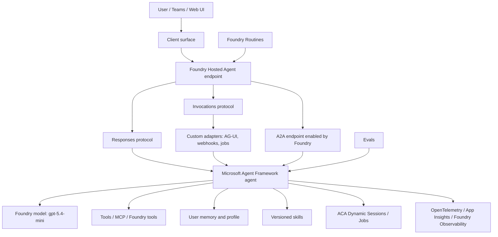

# Progressive Microsoft Agent Plan

## Intent

Build agent system step by step. Each step must be a working solution. All steps live under one top-level folder. Each step lives in its own numbered directory. Next step starts by copying previous step and adding one complexity layer.

Goal is not big-bang Hermes. Goal is small proof, then next proof, then next proof.

## Repository layout

```text
progressive-agents/
  01-foundry-responses-baseline/
  02-foundry-invocations-baseline/
  03-a2a-enabled-responses-agent/
  04-ag-ui-local-adapter/
  05-ag-ui-through-invocations/
  06-foundry-observability-evals/
  07-foundry-memory-profile/
  08-skill-system-baseline/
  09-guarded-skill-evolution/
  10-agent365-registration/
  11-teams-agent-surface/
  12-scheduled-routines/
  13-worker-sandbox-dispatch/
  14-multi-replica-personalization/
  15-skill-distillation-generation/
```

Rule:

1. Copy previous directory.
2. Change only what this step needs.
3. Keep it runnable locally.
4. Keep it deployable if platform supports it.
5. Add smoke test.
6. Add short README in each directory with commands and known gaps.

## Core decisions

| Area | Decision |
|---|---|
| Language | Python |
| Package manager | `uv` |
| Project files | `pyproject.toml`, `uv.lock` |
| Agent framework | Microsoft Agent Framework |
| Model plane | Existing Microsoft Foundry project in Sweden Central |
| Initial model | `gpt-5.4-mini` deployment |
| First hosted protocol | Responses |
| Second hosted protocol | Invocations |
| A2A | Enable on Responses agent. Foundry-managed A2A endpoint. |
| AG-UI | Not native Hosted Agent protocol. Use local adapter first. Try Invocations bridge later. |
| Observability | Application Insights + OpenTelemetry + Foundry traces |
| Evals | Foundry evaluation path plus local repeatable scripts |
| Memory | Foundry Memory first if usable. Else abstraction over files/Cosmos/Search. |
| Skills | Explicit versioned skill packs. Manual first, guarded evolution later. |
| Teams/M365 | Agent 365 path, then Teams surface proof |
| Scheduling | Foundry Routines first. ACA Jobs/Sessions where useful. |
| Workers | ACA Dynamic Sessions or Jobs for sandbox/heavy execution |
| Multi-replica | Shared base skills, separate user memory/context/identity |

## Protocol truth

Hosted Agent container protocols:

- `responses`: main conversational path.
- `invocations`: arbitrary JSON/custom payload path.
- `invocations_ws`: preview and region-limited. Do not use for Sweden Central baseline.

Other protocols/features:

- Activity: platform bridge for Teams/M365 when publishing. Do not implement first.
- A2A: Foundry can expose A2A endpoint for agents that support Responses. Enable after Responses works.
- AG-UI: agent-to-user UI protocol. Not native Hosted Agent protocol. Use Agent Framework AG-UI adapter locally. If needed, bridge via Invocations.

Implication:

```text
Responses first.
Invocations second.
A2A layered on Responses.
AG-UI via local adapter or Invocations/proxy.
```

## Target architecture, final-ish



## Documentation links

Use these as primary references when implementing:

- Microsoft Agent Framework: <https://learn.microsoft.com/agent-framework/>
- Agent Framework first Python agent: <https://learn.microsoft.com/agent-framework/get-started/your-first-agent>
- Agent Framework Foundry provider: <https://learn.microsoft.com/agent-framework/agents/providers/microsoft-foundry>
- Agent Framework Hosted Agents: <https://learn.microsoft.com/agent-framework/hosting/foundry-hosted-agent>
- Foundry Hosted Agents concepts: <https://learn.microsoft.com/azure/foundry/agents/concepts/hosted-agents>
- Deploy Hosted Agent: <https://learn.microsoft.com/azure/foundry/agents/how-to/deploy-hosted-agent>
- Quickstart Hosted Agent: <https://learn.microsoft.com/azure/foundry/agents/quickstarts/quickstart-hosted-agent>
- Responses API quickstart: <https://learn.microsoft.com/azure/foundry/agents/quickstarts/responses-api>
- Enable incoming A2A: <https://learn.microsoft.com/azure/foundry/agents/how-to/enable-agent-to-agent-endpoint>
- Connect to A2A endpoint: <https://learn.microsoft.com/azure/foundry/agents/how-to/tools/agent-to-agent>
- A2A protocol: <https://a2a-protocol.org/latest/>
- Agent Framework AG-UI integration: <https://learn.microsoft.com/agent-framework/integrations/ag-ui/>
- AG-UI docs: <https://docs.ag-ui.com/introduction.md>
- Foundry observability and tracing: <https://learn.microsoft.com/azure/foundry/agents/concepts/observability>
- Foundry evaluations: <https://learn.microsoft.com/azure/ai-foundry/concepts/evaluation-approach-gen-ai>
- Foundry Memory: <https://learn.microsoft.com/azure/foundry/agents/how-to/memory>
- Agent 365 SDK: <https://learn.microsoft.com/microsoft-agent-365/developer/agent-365-sdk>
- Agent 365 get started: <https://learn.microsoft.com/microsoft-agent-365/developer/get-started>
- Agent 365 identity: <https://learn.microsoft.com/microsoft-agent-365/developer/identity>
- Microsoft 365 Agents SDK: <https://learn.microsoft.com/microsoft-365/agents-sdk/>
- ACA Dynamic Sessions: <https://learn.microsoft.com/azure/container-apps/sessions>
- ACA custom container sessions: <https://learn.microsoft.com/azure/container-apps/sessions-custom-container>
- ACA Jobs: <https://learn.microsoft.com/azure/container-apps/jobs>

Some links may move because features are preview. If a link is stale, search Microsoft Learn for the exact title.

## Step 01: Foundry Responses baseline

Directory: `progressive-agents/01-foundry-responses-baseline`

Build smallest useful agent.

Must have:

- Python project with `uv`.
- `pyproject.toml`.
- Microsoft Agent Framework dependencies.
- `FoundryChatClient`.
- Existing Foundry project endpoint from environment.
- Model deployment from environment, default `gpt-5.4-mini`.
- Hosted Agent Responses server.
- Local run command.
- Deploy command.
- Smoke test command.

Architecture:

```text
Client -> /responses -> ResponsesHostServer -> Agent Framework Agent -> Foundry model
```

Validation:

- Run locally.
- POST to `/responses`.
- Deploy to Foundry Hosted Agent.
- Invoke deployed endpoint.
- Response text returned.

Stop if:

- Existing Foundry project cannot deploy Hosted Agent in Sweden Central.
- `gpt-5.4-mini` deployment missing or inaccessible.

## Step 02: Foundry Invocations baseline

Directory: `progressive-agents/02-foundry-invocations-baseline`

Copy step 01. Add Invocations.

Must have:

- Responses still works.
- Invocations endpoint works.
- Custom JSON contract:

```json
{
  "message": "hello",
  "stream": false
}
```

Output:

```json
{
  "response": "..."
}
```

Architecture:

```text
Client -> /responses -> Agent
Client -> /invocations -> custom handler -> Agent
```

Validation:

- Local `/responses` test.
- Local `/invocations` test.
- Deployed `/responses` test.
- Deployed `/invocations` test.

Stop if:

- Hosted Agent cannot expose both protocols in one container/version.

## Step 03: A2A enabled Responses agent

Directory: `progressive-agents/03-a2a-enabled-responses-agent`

Copy step 02. Enable Foundry-managed incoming A2A.

Important:

- A2A depends on Responses.
- A2A is not the first container protocol.
- Foundry exposes `/endpoint/protocols/a2a`.
- Agent card required.
- Entra auth required.
- Text only for now.
- No streaming for now.

Must have:

- Script to PATCH agent endpoint protocols to include A2A.
- Script to configure agent card.
- Script to fetch agent card.
- Python A2A SDK smoke test.

Architecture:

```text
A2A caller -> Foundry A2A endpoint -> Foundry bridge -> Responses agent
```

Validation:

- Fetch `agentCard/v1.0`.
- Send A2A text message.
- Get text response.

Stop if:

- Foundry project does not expose A2A preview.
- Required role/permission missing.

## Step 04: AG-UI local adapter

Directory: `progressive-agents/04-ag-ui-local-adapter`

Copy step 03. Add local AG-UI endpoint.

Purpose:

- Prove rich UI protocol with Microsoft Agent Framework.
- Do not depend on Hosted Agent for AG-UI yet.

Must have:

- FastAPI AG-UI adapter using Agent Framework AG-UI package.
- Local AG-UI endpoint.
- Simple web UI or CopilotKit-compatible client.
- Optional TUI if easy.

Architecture:

```text
AG-UI web client -> local FastAPI AG-UI endpoint -> Agent Framework Agent -> Foundry model
```

Validation:

- Start local server.
- Open web UI.
- Send message.
- Stream response.
- Keep thread context.

Stop if:

- Python AG-UI integration is too immature. Then document and continue with web UI over Responses.

## Step 05: AG-UI through Invocations

Directory: `progressive-agents/05-ag-ui-through-invocations`

Copy step 04. Try Hosted Agent Invocations as AG-UI bridge.

Purpose:

- Test if custom AG-UI stream can go through Foundry Invocations.
- If not clean, document gap and use sidecar/proxy pattern later.

Must have:

- Invocations handler that can emit AG-UI-shaped events or SSE if platform allows.
- Client test.
- Clear conclusion:
  - native-enough through Invocations, or
  - sidecar/proxy required.

Architecture option A:

```text
AG-UI client -> Foundry /invocations -> AG-UI adapter -> Agent
```

Architecture option B:

```text
AG-UI client -> sidecar web app -> Foundry /responses or /invocations -> Agent
```

Validation:

- Streaming works, or failure documented with exact error/limitation.

Stop if:

- Foundry Invocations cannot carry required AG-UI streaming semantics.

## Step 06: Foundry observability and evals

Directory: `progressive-agents/06-foundry-observability-evals`

Copy step 05. Add visibility.

Must have:

- OpenTelemetry instrumentation.
- Application Insights connection string support.
- Correlation IDs.
- Structured logs.
- Trace spans for:
  - request received,
  - model call,
  - tool call,
  - memory read/write,
  - skill load/use,
  - worker dispatch.
- Basic eval dataset.
- Eval runner.

Architecture:

```text
Agent -> OpenTelemetry -> Application Insights -> Foundry Observability
Eval runner -> Agent endpoint -> eval results
```

Validation:

- Traces visible.
- Logs visible.
- Eval run produces report.

Stop if:

- Foundry observability page cannot see custom traces. Keep App Insights proof and document Foundry gap.

## Step 07: Foundry memory profile

Directory: `progressive-agents/07-foundry-memory-profile`

Copy step 06. Add user profile and preferences.

First investigate Foundry Memory.

Memory target:

```text
User profile
User preferences
Working notes
Long-term recall
Audit trail of changes
```

Must have:

- Memory abstraction in code.
- Foundry Memory implementation if available and suitable.
- Fallback file/Cosmos/Search implementation if Foundry Memory is not ready.
- Memory read/write tools.
- Audit log for memory changes.

Architecture:

```text
Agent -> Memory abstraction -> Foundry Memory
                         \-> fallback store
```

Validation:

- Store user preference.
- New turn recalls preference.
- Restart/deploy still recalls preference.
- Memory mutation is logged.

Stop if:

- Foundry Memory cannot be written/read by Hosted Agent with required lifecycle. Use fallback and keep interface.

## Step 08: Skill system baseline

Directory: `progressive-agents/08-skill-system-baseline`

Copy step 07. Add reusable skills.

Skill means:

- versioned unit,
- explicit metadata,
- reusable by replicas,
- testable,
- promotable.

Possible shape:

```text
skills/
  base/
    research/
      skill.toml
      instructions.md
      tools.py
      tests/
```

Must have:

- Skill manifest.
- Skill loader.
- Skill registry.
- At least two sample skills.
- Skill tests/evals.

Architecture:

```text
Agent startup -> skill registry -> selected skills -> agent tools/instructions
```

Validation:

- Agent loads base skills.
- Agent uses skill in response.
- Skill test passes.

Stop if:

- Agent Framework has native skill abstraction that should be used instead. Prefer platform-native if real.

## Step 09: Guarded skill evolution

Directory: `progressive-agents/09-guarded-skill-evolution`

Copy step 08. Add self-improvement, but guarded.

Allowed automatically:

- draft skill,
- propose edit,
- write evaluation case,
- summarize learning,
- open review artifact.

Not allowed automatically:

- promote skill to base,
- change identity,
- change permissions,
- change system policy,
- add risky tools,
- create proactive schedule.

Must have:

- Skill proposal format.
- Review queue.
- Eval gate.
- Audit log.
- Promotion command requiring human action.

Architecture:

```text
Agent learning -> proposal -> eval -> human review -> promoted skill
```

Validation:

- Agent proposes skill improvement.
- Eval runs.
- Proposal waits for approval.
- Approved skill becomes available.

Stop if:

- No safe review/promotion boundary exists.

## Step 10: Agent 365 registration

Directory: `progressive-agents/10-agent365-registration`

Copy step 09. Integrate with Agent 365.

Goal:

- Agent visible/governed in Agent 365.
- Identity story understood.
- Decide custom engine agent vs AI teammate path.

Must have:

- Agent 365 registration notes/scripts.
- Identity blueprint investigation.
- Observability integration if separate from Foundry.
- Required tenant/admin prerequisites.

Architecture:

```text
Hosted Agent -> Agent 365 registration/governance -> Entra/Purview/Defender/Observability
```

Validation:

- Agent appears in Agent 365 inventory or equivalent admin surface.
- Identity/blueprint details documented.
- Observability visible.

Stop if:

- Tenant lacks Frontier/Agent 365 capabilities.
- Hosted Agent cannot map to desired identity path.

## Step 11: Teams agent surface

Directory: `progressive-agents/11-teams-agent-surface`

Copy step 10. Publish/connect to Teams/M365.

Capabilities to test:

- 1:1 DM.
- Group chat mention.
- Channel mention.
- Reply thread.
- Emoji/reaction event.
- Private message.
- Proactive message.
- All-message/RSC-style access if available.

Must have:

- Teams/M365 publication path.
- Test matrix.
- Evidence of what works.
- Explicit gaps.

Architecture:

```text
Teams/M365 -> Activity/platform bridge -> Responses agent -> Agent Framework
```

Validation:

- DM works.
- Mention works.
- At least one group/channel scenario works.
- Gaps documented with exact platform behavior.

Stop if:

- Only classic bot fallback works and AI teammate/custom-engine goal is impossible. Re-decide.

## Step 12: Scheduled routines

Directory: `progressive-agents/12-scheduled-routines`

Copy step 11. Add scheduled work.

Priority:

1. Foundry Routines.
2. ACA Scheduled Jobs.
3. Internal cron only if needed.

Must have:

- Routine that invokes agent.
- Prompt/job definition stored as code.
- Run history.
- Idempotency key or run ID.
- Safe proactive behavior rules.

Architecture:

```text
Foundry Routine -> Hosted Agent -> scheduled prompt -> memory/tools
```

Validation:

- Routine fires.
- Agent processes scheduled prompt.
- Run result visible.
- Duplicate run does not corrupt state.

Stop if:

- Foundry Routines unavailable in target region/project. Use ACA Scheduled Jobs fallback.

## Step 13: Worker sandbox dispatch

Directory: `progressive-agents/13-worker-sandbox-dispatch`

Copy step 12. Add external workers for heavy/risky work.

Target:

- ACA Dynamic Sessions for fast isolated execution.
- ACA Jobs for queue/scheduled/parallel work.

Must have:

- Worker dispatch tool.
- Worker result contract.
- Artifact storage path.
- Timeout/cancel behavior.
- Trace correlation from agent to worker.

Architecture:

```text
Agent -> dispatch tool -> ACA Dynamic Session / ACA Job -> artifact/result -> Agent
```

Validation:

- Agent sends task to worker.
- Worker runs isolated command or code.
- Result returns.
- Trace links request and worker.

Stop if:

- ACA Dynamic Sessions cannot run required image or region unsupported. Use ACA Jobs first.

## Step 14: Multi-replica personalization

Directory: `progressive-agents/14-multi-replica-personalization`

Copy step 13. Run multiple replicas.

Model:

```text
Base agent version
Base skills
Replica A: user memory A, identity/context A
Replica B: user memory B, identity/context B
```

Must have:

- Replica config.
- Separate memory namespace per user/replica.
- Shared base skill pack.
- No cross-user leakage.
- Deployment or local simulation of multiple replicas.

Architecture:

```text
Base image + base skills -> multiple agent instances -> isolated user memory
```

Validation:

- Replica A remembers A-only preference.
- Replica B cannot see A-only preference.
- Shared skill update can be rolled to both.

Stop if:

- Foundry Hosted Agent versioning/identity model cannot represent replicas cleanly. Use config-level simulation first.

## Step 15: Skill distillation generation

Directory: `progressive-agents/15-skill-distillation-generation`

Copy step 14. Add learning consolidation.

Goal:

- Replicas learn locally.
- Proposals collected.
- Common improvements distilled into next base skill generation.
- New base deployed.
- Replicas upgraded.

Must have:

- Skill proposal aggregator.
- Deduplication.
- Eval battery.
- Human review.
- Base skill version bump.
- Rollout strategy.

Architecture:

```text
Replica proposals -> aggregator -> evals -> reviewed base skills vNext -> redeploy replicas
```

Validation:

- Two replicas produce similar proposals.
- Aggregator creates candidate base skill.
- Evals pass.
- Human promotes.
- New replica uses promoted skill.

Stop if:

- No reliable eval signal. Keep proposals local until eval quality improves.

## Cross-cutting rules

### Configuration

Use environment variables. No secrets in repo.

Expected names:

```text
FOUNDRY_PROJECT_ENDPOINT
AZURE_AI_MODEL_DEPLOYMENT_NAME
APPLICATIONINSIGHTS_CONNECTION_STRING
```

Add more only when needed.

### Testing

Each step needs smallest useful tests:

- unit tests for local logic,
- smoke script for local endpoint,
- smoke script for deployed endpoint if deployed,
- eval where behavior quality matters.

### Deployment

Prefer `azd` for Hosted Agent scaffold/deploy if possible.

Useful commands:

```text
azd ai agent run
azd ai agent invoke "hello"
azd deploy
azd ai agent monitor --follow
```

### Documentation per step

Each directory README:

```text
What this step proves
Architecture
Prerequisites
Local run
Deploy
Smoke tests
Known gaps
Next step
```

### Security

No secret in code.
No memory writes without audit.
No autonomous permission/identity changes.
No cross-replica memory access.
No skill promotion without review.

### Done definition per step

Step is done only when:

1. local run works,
2. tests/smoke pass,
3. deploy works if platform feature is available,
4. README updated,
5. known gaps documented,
6. next step can copy this directory and continue.
