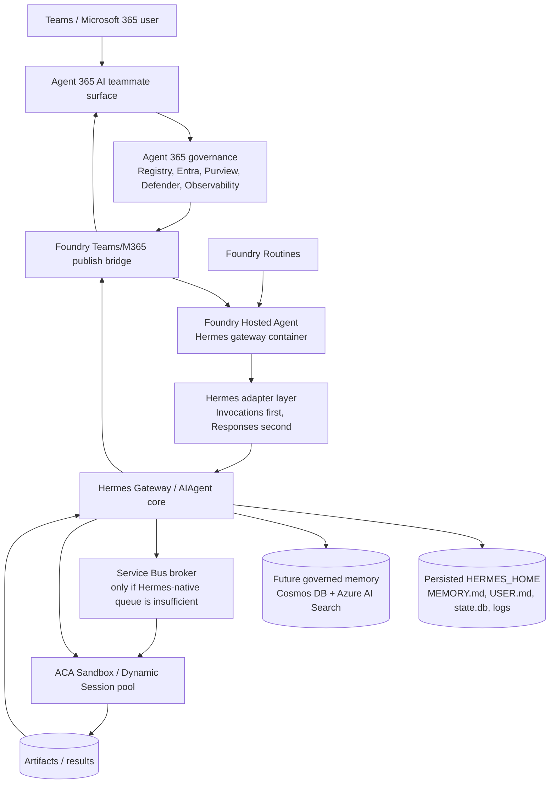

# Hermes Implementation Plan

## 1. Decisions captured

This plan is based on the decisions from the planning discussion.

| Area | Decision |
|---|---|
| Implementation scope | **POC first**: prove the risky platform assumptions before production hardening |
| Gateway host | **Foundry Hosted Agent only** for the gateway |
| Microsoft 365 identity | **Agent 365 AI teammate only**; no classic Teams bot fallback in the first plan |
| Teams capabilities to prove | DM, group mentions, channel mentions, reply threading, emoji/reactions, proactive messages, all-message/RSC-style access, Agent 365 governance visibility |
| Foundry protocol strategy | **Invocations first**, then **Responses** for Teams/M365 publishing |
| Worker strategy | Focus on the new **ACA Sandboxes** announced at Build 2026, mapped in current docs to ACA Dynamic Sessions / custom container session pools |
| Worker broker | Prefer Hermes-native queue/scheduling if it exists and is sufficient; otherwise use **Azure Service Bus** |
| Scheduling | **Foundry Routines primary** |
| Memory | Start with persisted Hermes state, then add **Cosmos DB + Azure AI Search** |
| Self-evolution | **Guarded autonomy**: memory/skills allowed with audit; instructions/config/identity changes require review |
| Initial deployment target | **MJy subscription** / tenant where admin access is available for Agent 365 and Entra setup |
| Plan depth | Comprehensive implementation plan |

## 2. POC goal

Build a first working Hermes deployment where:

1. Hermes runs as a **Foundry Hosted Agent custom container**.
2. Hermes is published as an **Agent 365 AI teammate** with its own governed Microsoft 365 identity.
3. Hermes can be reached in Teams/M365 through the AI teammate path.
4. Hermes can process lightweight interactions in the gateway.
5. Hermes can dispatch heavy work into **ACA Sandboxes / Dynamic Sessions**.
6. Hermes memory persists across restarts and is prepared for governed self-evolution.
7. Scheduling is handled through **Foundry Routines**.

The POC is considered successful only if the identity and interaction model is proven without falling back to classic Teams bot identity.

## 3. Non-goals for the first POC

- Do not build a classic Teams bot fallback unless the AI teammate path is proven impossible and a new decision is made.
- Do not use Azure Functions.
- Do not optimize for production scale before proving identity, Teams surface behavior, Foundry container hosting, and ACA Sandbox dispatch.
- Do not implement a custom Cosmos DB memory plugin until Hermes-native state persistence is working in the hosted container.
- Do not allow autonomous changes to identity, tenant registration, permissions, or core operating instructions without review.

## 4. Target architecture

## 5. Key architecture principles

### 5.1 Foundry-only gateway

The gateway should run only as a Foundry Hosted Agent in the POC. This deliberately tests the most managed path first:

- custom Hermes container image;
- Foundry-managed endpoint;
- Foundry agent identity;
- Foundry protocol surface;
- Foundry observability;
- Foundry Routines.

If Foundry cannot provide the required Teams/M365 AI teammate behavior, the plan should stop at a decision gate rather than silently falling back to ACA gateway hosting.

### 5.2 AI teammate only

The identity target is an Agent 365 AI teammate / agent-user identity. The POC should prove that Hermes can behave as a standalone Microsoft 365 participant, not merely as a bot acting on behalf of a user.

The POC must validate:

- agent appears in Agent 365 registry/governance surfaces;
- agent has a distinct identity;
- user can DM the agent;
- user can mention the agent in group chats and channels if the AI teammate surface supports it;
- replies can preserve context/threading;
- proactive messages are possible;
- emoji/reaction events are either supported or explicitly confirmed as a platform gap.

### 5.3 ACA Sandboxes for work, not gateway

ACA Sandboxes / Dynamic Sessions are for bursty execution, untrusted tool/code execution, and parallel worker tasks. They should not host the gateway in the first POC.

Use cases:

- run shell/code execution away from the gateway;
- run parallel subagent-like work;
- execute risky or resource-heavy tools;
- produce artifacts and return summaries/results to Hermes.

### 5.4 Foundry Routines for schedules

Foundry Routines are the primary scheduling mechanism. Hermes cron may exist, but in this plan it is a fallback for Hermes-native memory/context scheduling only after we inspect whether it conflicts with Foundry's managed scheduling model.

### 5.5 Guarded self-evolution

Hermes should be able to improve memory and create skills, but only inside controlled boundaries.

Allowed autonomously with audit:

- memory notes;
- task summaries;
- skill drafts;
- worker result indexing;
- non-privileged tool configuration suggestions.

Requires human review:

- identity/permission changes;
- Agent 365 registration changes;
- Entra app or blueprint changes;
- `AGENTS`/system instruction changes;
- gateway config changes;
- new proactive schedule creation;
- changes that increase external data access.

## 6. Implementation phases

## Phase 0: Prerequisite and access validation

### Objective

Confirm that the target tenant/subscription can support the chosen Foundry-only + AI teammate-only path.

### Tasks

1. Confirm access to the **MJy subscription** and target resource group strategy.
2. Confirm Global Admin or equivalent role for:
   - Agent 365 setup;
   - Entra Agent ID / agent blueprint operations;
   - M365 app publishing/admin approval;
   - consent grants;
   - Teams/M365 agent publication.
3. Confirm availability/licensing for:
   - Agent 365;
   - AI teammate / Frontier preview if required;
   - Foundry Hosted Agents;
   - Foundry Routines;
   - ACA Dynamic Sessions / custom container session pools;
   - Azure Container Registry;
   - Azure Service Bus;
   - Cosmos DB;
   - Azure AI Search;
   - Key Vault;
   - Application Insights / Log Analytics.
4. Confirm target regions supporting all required preview features.
5. Confirm whether Microsoft 365 AI teammate can be used by a non-Microsoft custom container agent.

### Validation gate

Proceed only if:

- Foundry Hosted Agents are available;
- Agent 365 AI teammate setup is available;
- a custom Hosted Agent can be published to the required M365/Teams surface;
- ACA Sandbox / Dynamic Session pools are available in a compatible region.

### Stop conditions

Stop and re-decide if:

- AI teammate cannot be used for custom agents;
- Foundry Hosted Agent cannot publish to M365/Teams in the required way;
- tenant lacks required Agent 365 / Frontier features.

## Phase 1: Hermes container baseline

### Objective

Create a reproducible Hermes gateway container suitable for Foundry Hosted Agent deployment.

### Tasks

1. Choose container source:
   - start from official `nousresearch/hermes-agent` image if compatible;
   - otherwise build a thin derived image.
2. Define container runtime layout:
   - `HERMES_HOME`;
   - writable state directory;
   - logs;
   - API server port;
   - health endpoint;
   - protocol adapter entry point.
3. Configure Hermes model provider for Foundry-hosted model endpoints.
4. Enable Hermes API server if needed for internal adapter calls.
5. Define secrets through Key Vault or Foundry/Hosted Agent secret injection:
   - model credentials if needed;
   - Agent 365 credentials if required;
   - Service Bus connection/RBAC path;
   - storage/database endpoints.
6. Add health checks:
   - container process alive;
   - Hermes gateway/API reachable;
   - state path writable;
   - model endpoint reachable;
   - memory path readable/writable.

### Deliverables

- Container image definition.
- Runtime configuration manifest.
- Local container run instructions.
- Health check endpoint mapping.
- Secret/environment variable inventory.

### Validation gate

Hermes container runs locally and can:

- start cleanly;
- respond to health check;
- run a simple Hermes turn;
- persist state across restart using mounted `HERMES_HOME`;
- emit logs.

## Phase 2: Foundry Hosted Agent deployment

### Objective

Deploy the Hermes gateway container as a Foundry Hosted Agent.

### Tasks

1. Create Foundry project/resources.
2. Create or configure ACR/image publishing compatible with Hosted Agents.
3. Deploy Hermes as Hosted Agent custom container.
4. Assign Foundry/agent identity permissions for:
   - Key Vault secret read;
   - storage state access if externalized;
   - Service Bus if used;
   - Cosmos DB / Azure AI Search later.
5. Validate Foundry protocols:
   - Invocations endpoint receives arbitrary JSON;
   - adapter can translate invocation payload into Hermes turn;
   - response is returned correctly.
6. Add Responses protocol support:
   - map conversation/session identifiers;
   - map user message into Hermes;
   - return final answer;
   - decide how to handle streaming if unsupported by target M365 surface.
7. Enable Foundry observability:
   - Application Insights;
   - OTel spans for gateway receive, Hermes turn, worker dispatch, memory update.

### Deliverables

- Hosted Agent deployment.
- Protocol adapter skeleton.
- Invocations smoke test.
- Responses smoke test.
- Observability baseline.

### Validation gate

Foundry can invoke Hermes and receive a response through Invocations. Responses support is either working or has a clearly documented adapter gap.

## Phase 3: Agent 365 AI teammate publication

### Objective

Publish Hermes as an Agent 365 AI teammate and validate the identity model.

### Tasks

1. Create Agent 365 blueprint/app/agent-user identity as required.
2. Bind the Foundry Hosted Agent endpoint to the Agent 365 / M365 publication flow.
3. Complete admin consent and publication steps.
4. Validate governance surfaces:
   - Agent 365 registry;
   - Agent Map;
   - Entra identity;
   - ownership/sponsor fields;
   - audit/observability presence.
5. Validate user-visible identity:
   - appears as distinct agent;
   - mentionable by name;
   - correct people/profile card behavior if available;
   - no confusing bot-only identity.

### Deliverables

- AI teammate registration notes.
- Identity/permission mapping.
- Governance screenshots or documented evidence.
- Publication runbook.

### Validation gate

Hermes is visible as the intended Agent 365 AI teammate, and a user can reach it through at least one Microsoft 365 surface.

### Stop condition

If Foundry Hosted Agent cannot be bound to AI teammate identity, pause and decide whether to:

1. continue Foundry-only with reduced identity expectations;
2. switch to Hermes-A365;
3. introduce a non-Foundry gateway;
4. wait for platform capability.

## Phase 4: Teams/M365 interaction validation

### Objective

Validate all requested Teams capabilities through the AI teammate path.

### Test matrix

| Capability | Test | Required result |
|---|---|---|
| 1:1 DM | Send private message to Hermes | Hermes responds as AI teammate |
| Group mention | Mention Hermes in group chat | Hermes receives and responds |
| Channel mention | Mention Hermes in channel | Hermes receives and responds |
| Reply threading | Reply to a message or ask Hermes to reply in thread | Response preserves expected thread/reply context |
| Emoji/reactions | React to Hermes/user message | Hermes receives event, or platform gap is documented |
| Proactive message | Trigger Foundry Routine to send message | Hermes can send a governed proactive message |
| All-message access | Message without mention in allowed scope | Hermes receives message only if AI teammate/RSC equivalent supports it |
| Governance visibility | Inspect Agent 365 logs/registry | Interaction visible/auditable |

### Implementation notes

- If the AI teammate path does not expose all-message/RSC-style access, document it as a platform gap.
- If emoji/reaction activity is not delivered, document it as a platform gap rather than emulating it.
- If reply threading requires a specific Activity protocol field, add it in the Responses/Activity adapter.

### Deliverables

- Teams capability test report.
- Required adapter changes.
- Confirmed platform gaps.

### Validation gate

The POC must pass DM, mention, governance visibility, and at least one group/channel interaction. Reply threading, emoji, and all-message access may become documented gaps if unsupported by AI teammate APIs.

## Phase 5: ACA Sandbox worker execution

### Objective

Enable Hermes to dispatch heavy work into ACA Sandboxes / Dynamic Sessions.

### Tasks

1. Create ACA environment in compatible region.
2. Create custom container session pool for Hermes workers.
3. Define worker image:
   - minimal runtime;
   - tools needed by Hermes tasks;
   - strict sandbox permissions;
   - no long-lived secrets;
   - outbound network restricted where possible.
4. Implement dispatch path:
   - Hermes adapter calls ACA session pool directly for synchronous sandbox work;
   - if async/durable work is required, introduce Service Bus.
5. Implement result return:
   - direct response for synchronous jobs;
   - artifact upload to storage for larger outputs;
   - correlation ID for every worker run.
6. Add timeout/cancellation handling.
7. Add worker telemetry.

### Service Bus decision gate

Before adding Service Bus, inspect Hermes gateway capabilities:

| Question | If yes | If no |
|---|---|---|
| Does Hermes already have durable queueing? | Reuse it if compatible with Foundry Hosted Agent | Use Service Bus |
| Does Hermes scheduling survive restarts and integrate with gateway sessions? | Use only for Hermes-native schedules | Keep Foundry Routines primary |
| Can Hermes dispatch external workers cleanly? | Build a Hermes worker tool/plugin | Add broker/adapter layer |

### Deliverables

- ACA Sandbox/session pool deployment.
- Worker container image.
- Hermes worker dispatch tool/adapter.
- Sample task proving sandbox execution.
- Worker telemetry/correlation.

### Validation gate

Hermes can receive a Teams/M365 message, decide to use a sandbox, execute work in ACA, and return the result to the user.

## Phase 6: Scheduling with Foundry Routines

### Objective

Use Foundry Routines as the primary cron mechanism.

### Tasks

1. Create a simple recurring Routine invoking Hermes.
2. Define routine payload schema:
   - routine name;
   - intent;
   - target conversation/context;
   - whether proactive response is allowed;
   - worker policy.
3. Route Routine payload through Hermes Invocations adapter.
4. Validate proactive message back to Teams/M365 if supported.
5. Add schedule audit:
   - who created it;
   - why it exists;
   - next run;
   - last run status;
   - output link.

### Deliverables

- Foundry Routine definition.
- Routine payload schema.
- Scheduled task validation report.

### Validation gate

Routine triggers Hermes without Azure Functions and produces either a governed proactive message or an auditable result.

## Phase 7: Memory persistence and self-evolution

### Objective

Persist Hermes memory safely and prepare for self-evolving behavior.

### Stage 7A: Native Hermes state

Tasks:

1. Persist `HERMES_HOME` in the Hosted Agent environment if supported.
2. If Foundry persisted files are insufficient, mount/use Azure Files-equivalent persistent storage if compatible with Hosted Agents.
3. Validate persistence of:
   - `state.db`;
   - `MEMORY.md`;
   - `USER.md`;
   - logs;
   - skills/hooks if used.
4. Keep a single write-active gateway session/model for state writes.
5. Add backup/snapshot process.

Validation:

- restart Hosted Agent session;
- verify memory persists;
- verify no state corruption;
- verify audit trail exists.

### Stage 7B: Structured governed memory

Tasks:

1. Design memory schema in Cosmos DB or PostgreSQL:
   - memory item;
   - source interaction;
   - confidence;
   - authority;
   - expiry;
   - sensitivity;
   - embedding reference;
   - review status;
   - created/updated by;
   - correlation ID.
2. Add Azure AI Search index for semantic recall.
3. Decide whether to build:
   - Hermes memory provider plugin;
   - sidecar memory service;
   - MCP memory tool.
4. Implement read path first.
5. Implement write path with guarded autonomy.
6. Add review queue for sensitive/instruction-affecting memory.

Validation:

- Hermes retrieves relevant prior memory;
- Hermes writes safe memory autonomously;
- sensitive memory requires review;
- memory can be deleted/expired;
- memory changes are auditable.

### Self-evolution policy implementation

| Change type | Allowed automatically? | Required controls |
|---|---|---|
| User preference memory | Yes | Audit, source link, delete/expire support |
| Task/project memory | Yes | Audit, confidence, source |
| Skill draft | Yes | Stored as draft, reviewed before activation |
| Skill activation | No | Human approval |
| System instruction change | No | Human approval |
| Agent identity/permissions | No | Admin approval |
| New proactive schedule | No | Human approval |
| Worker tool expansion | No | Security review |

## Phase 8: Observability, security, and governance

### Objective

Make the POC inspectable and safe enough for iterative development.

### Observability tasks

1. Define correlation ID propagated across:
   - M365 activity;
   - Foundry invocation;
   - Hermes session;
   - worker dispatch;
   - memory update.
2. Emit spans/logs for:
   - message received;
   - identity context;
   - Hermes turn start/end;
   - tool calls;
   - worker dispatch;
   - memory read/write;
   - proactive message.
3. Connect logs to Application Insights / Log Analytics.
4. Create a minimal dashboard:
   - successful interactions;
   - failed interactions;
   - worker runs;
   - routine runs;
   - memory writes;
   - approval-required events.

### Security tasks

1. Store secrets in Key Vault or managed secret store.
2. Use managed identities/RBAC where possible.
3. Restrict ACA Sandbox egress where possible.
4. Keep untrusted worker artifacts separate from Hermes state.
5. Add allowlist/policy for who can interact with the POC.
6. Review permissions granted to AI teammate.
7. Document data flows for Purview/DLP review.

### Governance tasks

1. Confirm Agent 365 registry metadata:
   - owner;
   - sponsor;
   - purpose;
   - data access;
   - lifecycle.
2. Confirm audit events appear for interactions.
3. Confirm deactivation/removal process.
4. Define review process for memory/instruction changes.

## 7. Backlog structure

### Epic A: Platform prerequisites

- Validate tenant licensing and preview access.
- Validate regions.
- Create resource group and naming convention.
- Create Foundry project.
- Create ACR/registry path.
- Create Key Vault.
- Create Log Analytics/Application Insights.

### Epic B: Hermes Hosted Agent

- Build Hermes container.
- Configure state path.
- Add health checks.
- Deploy to Foundry Hosted Agent.
- Implement Invocations adapter.
- Implement Responses adapter.
- Add telemetry.

### Epic C: Agent 365 AI teammate

- Create blueprint/agent identity.
- Publish to M365/Teams.
- Validate governance visibility.
- Validate DM.
- Validate group/channel mention.
- Validate reply threading.
- Validate proactive message.
- Validate emoji/reaction support or gap.
- Validate all-message access or gap.

### Epic D: ACA Sandboxes

- Create ACA environment.
- Create custom container session pool.
- Build worker image.
- Implement Hermes worker dispatch.
- Add Service Bus only if required.
- Implement result handling.
- Add telemetry and timeouts.

### Epic E: Scheduling

- Create Foundry Routine.
- Define schedule payload schema.
- Route schedule into Hermes.
- Validate proactive output.
- Add schedule audit trail.

### Epic F: Memory and self-evolution

- Persist Hermes native state.
- Snapshot/backup state.
- Design governed memory schema.
- Add Cosmos DB/PostgreSQL.
- Add Azure AI Search.
- Implement read path.
- Implement guarded write path.
- Add review workflow.

### Epic G: Security and operations

- RBAC review.
- Key Vault integration.
- Sandbox egress policy.
- Data flow documentation.
- Observability dashboard.
- Deactivation/runbook.

## 8. Validation plan

### End-to-end POC scenario

1. User sends DM to Hermes in Teams/M365.
2. Hermes responds as AI teammate.
3. User mentions Hermes in a group or channel.
4. Hermes receives message through Foundry Hosted Agent.
5. Hermes decides task requires sandbox execution.
6. Hermes starts ACA Sandbox worker.
7. Worker completes and returns result.
8. Hermes stores memory summary.
9. Hermes replies in the correct conversation/thread.
10. Agent 365 governance/observability shows the interaction.
11. Foundry telemetry shows gateway invocation.
12. ACA telemetry shows worker execution.

### Pass/fail criteria

| Criterion | Pass condition |
|---|---|
| Foundry hosting | Hermes runs as Hosted Agent custom container |
| AI teammate identity | Hermes appears and behaves as AI teammate |
| DM | User can DM Hermes and receive response |
| Group/channel | Hermes can be mentioned and respond |
| Reply threading | Response preserves expected thread context, or platform gap is documented |
| Emoji/reactions | Event is handled, or platform gap is documented |
| Proactive message | Foundry Routine can cause governed message/result |
| Worker dispatch | Hermes can run task in ACA Sandbox |
| Memory persistence | Memory survives restart |
| Governance | Agent 365 surfaces show agent and activity |
| Observability | Correlated traces exist across gateway and worker |

## 9. Major risks and mitigations

| Risk | Impact | Mitigation |
|---|---|---|
| Foundry Hosted Agent cannot publish as AI teammate | Core identity goal blocked | Phase 3 stop gate; decide whether to use Hermes-A365 or wait |
| AI teammate lacks group/channel support | Teams scenario incomplete | Document platform gap; decide whether to relax AI-teammate-only constraint |
| Emoji/reaction events unavailable | Feature gap | Treat as explicit platform gap; do not fake support |
| Foundry Responses bridge incompatible with Hermes | Gateway integration delay | Keep Invocations adapter first; add thin Responses adapter |
| Hermes state not safe on hosted persisted filesystem | Memory persistence risk | Keep single writer; move memory to Cosmos/Postgres sooner |
| ACA Sandbox cannot run needed worker image | Worker strategy blocked | Use smaller specialist worker images |
| Service Bus required but adds complexity | More infra | Add only after Hermes-native queue inspection |
| Preview feature churn | Rework | Keep POC small and document versions |
| Over-permissioned AI teammate | Security risk | Least privilege, review grants, Purview/Defender validation |
| Self-evolution corrupts instructions/memory | Trust risk | Guarded autonomy, snapshots, review queue |

## 10. Immediate next steps

1. Validate MJy subscription and tenant feature availability.
2. Create a minimal Hermes container baseline.
3. Deploy it as a Foundry Hosted Agent with Invocations protocol.
4. Prove one simple invocation into Hermes.
5. Start Agent 365 AI teammate publication path.
6. In parallel, create an ACA Sandbox session pool and prove a simple worker invocation.
7. Add Foundry Routine that invokes Hermes.
8. Persist `HERMES_HOME` and validate memory survives restart.

## 11. First implementation milestone

**Milestone 1: Foundry-hosted Hermes echo**

Success criteria:

- Hermes container runs in Foundry Hosted Agent.
- Foundry Invocations endpoint reaches Hermes.
- Hermes returns a response.
- Logs appear in Application Insights.
- `HERMES_HOME` is writable and persists across a controlled restart if supported.

**Milestone 2: AI teammate reachability**

Success criteria:

- Hermes is registered/published as Agent 365 AI teammate.
- User can DM Hermes.
- Agent appears in governance surfaces.

**Milestone 3: Teams capability proof**

Success criteria:

- Group or channel mention reaches Hermes.
- Reply threading behavior is verified.
- Proactive routine message is verified.
- Emoji/reaction support is verified or documented as unavailable.

**Milestone 4: ACA Sandbox worker**

Success criteria:

- Hermes dispatches a task to ACA Sandbox.
- Worker completes and returns result.
- Hermes replies to the user with worker output.
- Worker run is correlated in telemetry.

**Milestone 5: Guarded memory**

Success criteria:

- Hermes stores memory.
- Memory persists.
- Memory write is auditable.
- Sensitive/self-evolution change requires review.

