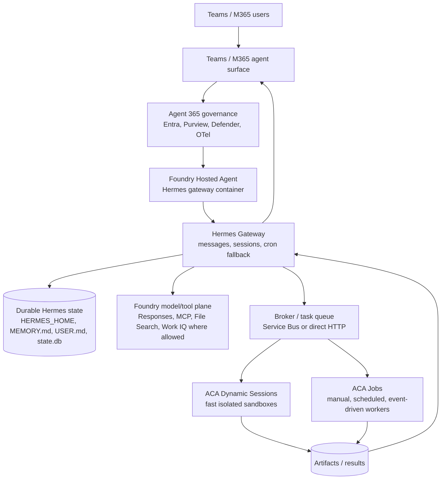
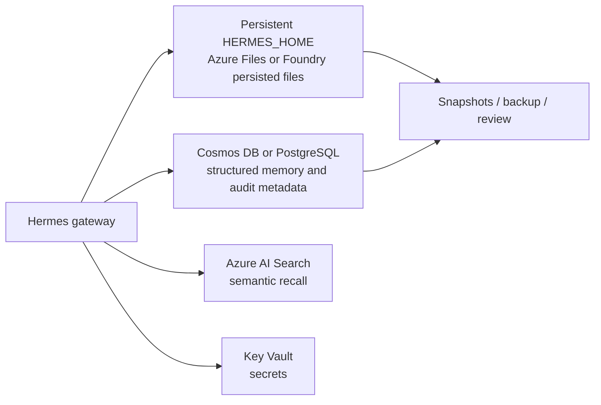

# Hermes + Microsoft 365 Autopilots / Agent 365 + Foundry Hosted Agents + ACA Sandboxes

## Executive summary

The target architecture is plausible: run a minimal always-on Hermes gateway as a custom container, govern/publish it through Microsoft Agent 365, and dispatch heavy or risky work to ephemeral Azure Container Apps (ACA) Dynamic Sessions or ACA Jobs. Foundry Hosted Agents are the preferred gateway host if the preview can run the Hermes container and its Teams/M365 publishing path satisfies the required interaction model. Hosted Agents are described as bring-your-own-code containers with managed endpoint, Entra agent identity, scale-to-zero sessions, persisted session files, observability, and protocols such as Responses, Invocations, Activity, and A2A.[^foundry-hosted]

The biggest risk is identity and Teams surface mismatch. Microsoft announced **Autopilots** as a new category of always-on autonomous agents with their own identity, but the general third-party Autopilot development path is not yet clear from the researched material.[^autopilots] Agent 365 plus AI teammate / agent-user identity is the closest fit for a standalone, mentionable, governed Microsoft 365 participant, but AI teammate capabilities are still Frontier/preview. Traditional Teams bots and custom-engine agents have more mature group/chat/channel support, but they are bot-shaped rather than full user-like entities.[^agent365-identity][^teams-group]

Hermes is a good substrate because it already separates a long-running **gateway** from the core `AIAgent` loop. The gateway handles messaging platforms, authorization, sessions, cron, and delivery; the CLI, gateway, ACP, API server, batch runner, and library all converge on the same `AIAgent` core.[^hermes-architecture][^hermes-gateway] Hermes does **not** natively dispatch subagents to separate durable containers: `delegate_task` is in-process and synchronous, so ACA workers should be introduced through a broker/protocol boundary such as HTTP Invocations, A2A/MCP, Service Bus, or an SSH/terminal backend.[^hermes-delegation]

## Recommended first architecture

### Baseline design

1. **Gateway:** package Hermes as a Foundry Hosted Agent custom container where possible. Foundry supplies the managed endpoint, agent identity, scaling, persistent session filesystem, and observability.[^foundry-hosted]
2. **Protocol:** expose Hermes through Foundry **Invocations** for arbitrary broker events; add **Responses** if publishing through Foundry's Teams/M365 bridge.
3. **Teams/M365 identity:** pursue Agent 365 / AI teammate for the full "own identity" goal; keep Hermes-A365 and the classic Teams bot adapter as pragmatic fallbacks for group chat/channel behavior until AI teammate group support and Foundry publishing are proven.[^hermes-a365][^hermes-teams]
4. **Workers:** use ACA Dynamic Sessions for fast isolated sandboxes and ACA Jobs for queue-triggered, scheduled, or finite parallel work.[^aca-sessions][^aca-jobs]
5. **Scheduling:** prefer Foundry Routines for simple cron/timer triggers; use ACA Scheduled Jobs for worker-side schedules; use Hermes cron when the schedule must preserve Hermes-native context and memory semantics.[^foundry-routines][^hermes-tools]
6. **Memory:** persist Hermes-native state first, then add governed structured/vector memory with Cosmos DB/PostgreSQL/Azure AI Search or a Hermes memory plugin. Do not depend on undocumented Foundry Memory as the primary self-evolution store yet.[^hermes-memory][^foundry-memory]

## Hermes findings

### Core and gateway

Hermes uses a fan-in architecture: CLI, Gateway, ACP, API Server, Batch Runner, and Python Library all route to `AIAgent`. Platform-specific behavior lives in entry points, not in the core agent loop.[^hermes-architecture]

The gateway is the minimal always-on component. It receives platform events, authorizes users, resolves session keys, creates an `AIAgent` with session history, runs the conversation, and sends the result back through the adapter.[^hermes-gateway] This fits the desired "lightweight gateway" pattern, but by default Hermes still executes the actual agent work in the gateway process.

Hermes has an official Docker image (`nousresearch/hermes-agent`). Mutable state lives under `/opt/data`; the installed application tree is under `/opt/hermes`; s6 supervises gateway/profile services in the container. The docs warn not to run two gateway containers against the same data directory simultaneously because session and memory stores are not designed for concurrent gateway writes.[^hermes-docker]

The Hermes API server can expose `/v1/chat/completions`, `/v1/responses`, `/v1/runs`, `/api/jobs`, `/api/sessions`, `/health`, `/v1/skills`, and `/v1/toolsets`. If Foundry protocol support does not map directly to Hermes, this API server is a useful internal adapter boundary.[^hermes-api]

### Delegation and workers

Hermes `delegate_task` creates child `AIAgent` instances with isolated context, but they run inside the parent's turn and block until completion. They are not a durable background queue and do not natively start remote ACA containers.[^hermes-delegation]

For durable external work, use one of these patterns:

| Pattern | Fit |
|---|---|
| Hermes -> Foundry/HTTP Invocations -> ACA Dynamic Session | Best for request-scoped sandbox work |
| Hermes -> Service Bus -> ACA Event-driven Job | Best for queue-backed async work |
| Hermes -> ACA Manual Job with `--parallelism N` | Best for explicit fan-out |
| Hermes -> SSH terminal backend into sandbox | Minimal Hermes changes, but operationally less clean |
| Hermes Kanban / multiple profiles | Native-ish multi-agent pattern, but SQLite/shared-state caveats apply |

## Microsoft 365 / Agent 365 findings

### Autopilots

"Microsoft 365 Autopilot" appears to be informal shorthand. The researched official term is **Autopilots**: always-on agents that work autonomously, have their own identity, and act on the user's behalf. Microsoft Scout was described as the first Autopilot.[^autopilots]

### Agent 365 governance

Microsoft Agent 365 is the control plane for observing, securing, and governing agents across the organization. The researched docs describe centralized registry/visibility, Agent Map, lifecycle governance, Entra identity governance, Purview data protection, Defender threat/risk signals, and observability.[^agent365-overview]

### Identity modes

| Identity mode | Fit for Hermes |
|---|---|
| Delegated / OBO | Useful for user-scoped access but not enough for a standalone entity |
| App/service principal | Good backend identity, but not user-like in Teams |
| AI teammate / agent user | Best fit for own identity, mentionability, mailbox/presence/org surfaces, and governance; currently preview/Frontier |

Work IQ API is especially important: researched docs indicate application-only auth is not supported; Work IQ requires delegated/OBO flows unless the agent has a user-like AI teammate identity.[^workiq]

### Teams capabilities and gaps

Traditional Teams bots/custom-engine agents support personal, groupchat, and team/channel scopes; @mentions; resource-specific consent permissions for reading all messages; reply threading with `replyToId`; proactive messaging with stored conversation references; and personal 1:1 chats.[^teams-group]

Hermes' classic Teams adapter already handles personal/group/channel routing and strips `<at>BotName</at>` mention tags before dispatch. It responds to all personal messages and to group/channel messages when mentioned.[^hermes-teams] Research did not confirm Hermes-side support for reaction/emoji events or explicit `replyToId` threading.

Hermes-A365 adds a more Agent 365-aligned path. It includes an Agent365 adapter, durable conversation registry, JWT validation, Bot Framework streaming/coalescing behavior, CLI registration/publish commands, AI Teammate path, and Custom Engine Agent path.[^hermes-a365] It looks like the most relevant bridge for full Agent 365 governance, but it should be validated against the exact group chat, reply-to, private message, and emoji requirements.

## Foundry Hosted Agents findings

Foundry Hosted Agents are custom containerized agent applications running on Foundry-managed infrastructure. The researched material says you choose the framework and runtime, package the code as a container image, and deploy to managed infrastructure.[^foundry-hosted]

Relevant capabilities:

| Capability | Assessment |
|---|---|
| Custom Hermes container | Strong fit |
| Managed endpoint | Strong fit |
| Agent identity | Strong fit, but not yet proven equivalent to AI teammate identity |
| Teams/M365 publish | Promising, preview/early access |
| Responses / Invocations / Activity / A2A protocols | Strong fit for adapters and workers |
| Routines | Good for cron/timer triggers |
| Observability | App Insights / OTel path is promising |
| Memory | Dedicated memory service unclear; use files/Cosmos/Search instead |

Foundry Routines support one-time timer and recurring cron-style triggers that invoke one prompt or hosted agent endpoint and record run history.[^foundry-routines] They should be the first choice for simple scheduled Hermes tasks.

Important caveats:

- Hosted Agents are still preview in the researched material.
- The exact path from Foundry Hosted Agent identity to Agent 365 AI teammate / agent-user identity is not proven.
- Foundry-published Teams/M365 behavior may differ from Hermes-A365 or classic Teams adapter behavior.
- Private ACR support and private networking constraints need validation for the target environment.

## ACA Dynamic Sessions and Jobs findings

ACA provides the "serverless but not Azure Functions" worker substrate:

| Requirement | Recommended ACA primitive |
|---|---|
| Fast isolated task sandbox | Dynamic Sessions / custom container session pool |
| Untrusted code execution | Dynamic Sessions with Hyper-V isolation and restricted egress |
| Queue-triggered async work | Event-driven ACA Jobs with KEDA scaler |
| Scheduled worker task | Scheduled ACA Job |
| Parallel multi-agent fan-out | Manual ACA Job with `--parallelism N` or many Dynamic Sessions |
| Long-running queue consumer | ACA App with KEDA scale-to-zero |

Dynamic Sessions are request-scoped sandboxes, not queues. The caller must allocate/use a session and submit work through the session pool endpoint.[^aca-sessions] Event-driven ACA Jobs are better for Service Bus/Storage Queue/Event Hubs/Kafka/Redis-driven processing; Scheduled Jobs are better for cron-like worker execution.[^aca-jobs]

## Memory and self-evolution

Hermes memory/state from the researched docs has three main layers:

1. **SQLite session state:** `state.db` under `HERMES_HOME`, with session/message storage and full-text search.[^hermes-memory]
2. **Persistent memory files:** `MEMORY.md` and `USER.md`, flushed before compression and used for durable context.[^hermes-memory]
3. **External memory providers:** Honcho, Mem0, Hindsight, Holographic, RetainDB, ByteRover, Supermemory, and others, with one active memory provider at a time.[^hermes-memory]

Recommended first memory design:

Start with persistent `HERMES_HOME` for compatibility, but keep one write-active gateway replica to avoid SQLite concurrency problems. Add Cosmos DB/PostgreSQL for governed structured memory and Azure AI Search for semantic recall when the prototype moves beyond local files. Treat any Foundry Memory tool as experimental until its API, lifecycle, governance, and write-back semantics are confirmed.[^foundry-memory]

Self-evolution needs explicit controls:

- Snapshot/version `MEMORY.md`, `USER.md`, skills, hooks, and config.
- Require human review for instruction/persona changes.
- Keep secrets in Key Vault, not in writable memory files.
- Separate trusted gateway state from untrusted ACA sandbox artifacts.
- Log memory updates and worker actions with correlation IDs.
- Avoid multiple gateway replicas writing the same Hermes state directory.

## Gateway host decision

| Criterion | Foundry Hosted Agent gateway | ACA gateway |
|---|---|---|
| Managed runtime | Stronger | More DIY |
| Custom Hermes container | Supported by researched Hosted Agents docs | Supported |
| Agent identity | Strong but needs AI teammate validation | Manual A365/Hermes-A365 integration |
| Teams/M365 publish | First-class but preview | Direct bot/A365 adapter control |
| Always-on webhook reachability | Needs proof with Hosted Agent session model | Straightforward with min replicas = 1 |
| Cron | Foundry Routines | ACA Scheduled Jobs or Hermes cron |
| Worker integration | Good via Invocations/A2A | Good via queues/HTTP |
| Operational control | Lower | Higher |

**Recommendation:** prototype the Foundry Hosted Agent gateway first because it matches the managed preference and may give the cleanest identity/observability story. Keep an ACA-hosted gateway fallback if Foundry publishing cannot deliver the required AI teammate/group chat/reply/reaction behavior.

## Open questions for next iteration

1. Can a Foundry Hosted Agent be provisioned or published as an Agent 365 **AI teammate** with agent-user identity?
2. Can Hermes expose the exact Responses contract expected by Foundry Teams/M365 publishing, or is a thin adapter needed?
3. Does Hermes-A365 satisfy group chat/channel behavior with AI teammate identity, or is the classic Teams adapter still required?
4. What is Foundry Memory's actual API and lifecycle, and can it support writable self-evolving memory?
5. Can ACA Dynamic Sessions run the Hermes worker image directly, or should worker images be smaller specialist containers?
6. What exact licenses/preview gates are available in the target tenant: Agent 365 Tier 3, M365 E7, Frontier, AI teammate, Foundry Hosted Agents, Teams publish?

## Confidence assessment

**High confidence:** Hermes has gateway/core separation, Docker deployment, local SQLite/file memory, cron/tooling, and in-process delegation. Foundry Hosted Agents support custom containers and Routines. ACA supports Dynamic Sessions and Jobs. Traditional Teams bot group/channel support exists. Agent 365 is the governance control plane.[^hermes-architecture][^hermes-docker][^foundry-hosted][^foundry-routines][^aca-sessions][^aca-jobs][^teams-group][^agent365-overview]

**Medium confidence:** Foundry Hosted Agent is the right first gateway host. The platform fit is strong, but Teams/M365 publishing behavior, response streaming/coalescing, and Agent 365 registration need a proof-of-concept.

**Low / unknown:** Full third-party Autopilot parity with Microsoft Scout, Foundry Hosted Agent promotion to AI teammate identity, Hermes reaction/emoji support, and Foundry Memory suitability for self-evolving Hermes memory.

## Footnotes

[^hermes-architecture]: Hermes architecture research, citing `hermes-agent.nousresearch.com/docs/developer-guide/architecture`, "System Overview" and "Directory Structure"; key files include `run_agent.py`, `gateway/run.py`, `gateway/session.py`, `hermes_state.py`, `agent/memory_manager.py`, and `plugins/memory/`.
[^hermes-gateway]: Hermes gateway research, citing `hermes-agent.nousresearch.com/docs/developer-guide/gateway-internals`; data flow: platform event -> adapter -> `GatewayRunner._handle_message()` -> authorization -> session key -> `AIAgent.run_conversation()` -> delivery.
[^hermes-docker]: Hermes Docker research, citing `hermes-agent.nousresearch.com/docs/user-guide/docker`; official image `nousresearch/hermes-agent`, mutable state under `/opt/data`, app tree under `/opt/hermes`, s6 supervision, and warning not to run two gateway containers against one data directory.
[^hermes-api]: Hermes API server research, citing `hermes-agent.nousresearch.com/docs/user-guide/features/api-server`; endpoints include `/v1/chat/completions`, `/v1/responses`, `/v1/runs`, `/api/jobs`, `/api/sessions`, `/health`, `/v1/skills`, and `/v1/toolsets`.
[^hermes-delegation]: Hermes delegation research, citing `hermes-agent.nousresearch.com/docs/user-guide/features/delegation`; `delegate_task` runs inside the parent's current turn, blocks until children finish, and is not a durable background job queue.
[^hermes-tools]: Hermes tool/cron research, citing `hermes-agent.nousresearch.com/docs/user-guide/features/tools`; toolsets include terminal, file, web, browser, delegation, memory, `cronjob`, and `send_message`.
[^hermes-memory]: Hermes memory/state research, citing `hermes-agent.nousresearch.com/docs/developer-guide/session-storage`; session storage uses `~/.hermes/state.db` or `$HERMES_HOME/state.db`, persistent memory files include `MEMORY.md` and `USER.md`, and external memory providers include Honcho, OpenViking, Mem0, Hindsight, Holographic, RetainDB, ByteRover, and Supermemory.
[^hermes-teams]: Hermes Teams/A365 research, citing `NousResearch/hermes-agent:plugins/platforms/teams/adapter.py` and `https://hermes-agent.nousresearch.com/docs/user-guide/messaging/teams`; classic Teams adapter uses Bot Framework auth, routes personal/group/channel messages, strips `<at>` mentions, and lacks confirmed reaction/emoji and `replyToId` handling in the researched implementation.
[^hermes-a365]: Hermes-A365 research, citing [`satscryption/Hermes-A365`](https://github.com/satscryption/Hermes-A365), especially `README.md`, `src/hermes_a365/plugin/adapter.py`, `src/hermes_a365/activity_bridge.py`, `src/hermes_a365/register.py`, and `references/m365-surface-coverage.md`; research identified AI Teammate and Custom Engine Agent paths, durable conversation registry, JWT validation, streaming/coalescing logic, and Agent 365 publish/setup CLI.
[^autopilots]: Microsoft 365 Autopilots research, citing `https://www.microsoft.com/en-us/microsoft-365/blog/2026/06/02/introducing-microsoft-scout-your-always-on-personal-agent/` and `https://learn.microsoft.com/en-us/microsoft-scout/overview`; the official term found was "Autopilots" rather than "Microsoft 365 Autopilot" as a product name.
[^agent365-overview]: Microsoft Agent 365 research, citing `https://learn.microsoft.com/en-us/microsoft-agent-365/overview` and `https://learn.microsoft.com/en-us/microsoft-365/admin/manage/agent-365-overview?view=o365-worldwide`; Agent 365 provides observe/govern/secure capabilities, registry/agent map, lifecycle management, and integrations with Entra, Purview, Defender, and observability.
[^agent365-identity]: Agent 365 identity research, citing `https://learn.microsoft.com/en-us/microsoft-agent-365/developer/identity` and `https://learn.microsoft.com/en-us/microsoft-agent-365/developer/get-started`; AI teammate/agent-user identity has its own principal/user-like identity, M365 presence, @mentionability, mailbox/OneDrive depending on licensing, and Frontier preview constraints.
[^workiq]: Work IQ API research, citing `https://learn.microsoft.com/en-us/microsoft-365/copilot/extensibility/work-iq/api-overview`; application-only authentication was reported unsupported, with delegated/OBO flows required unless using an agent-user identity.
[^teams-group]: Teams group/channel bot research, citing `https://learn.microsoft.com/en-us/microsoftteams/platform/bots/how-to/conversations/channel-and-group-conversations`, `https://learn.microsoft.com/en-us/microsoftteams/platform/bots/how-to/conversations/channel-messages-for-bots-and-agents`, and `https://learn.microsoft.com/en-us/microsoftteams/platform/bots/how-to/conversations/send-proactive-messages`; groupchat/team scopes, @mentions, RSC all-message permissions, reply threading, and proactive-message constraints are documented there.
[^foundry-hosted]: Foundry Hosted Agents research, citing `https://learn.microsoft.com/en-us/azure/foundry/agents/concepts/hosted-agents` and `https://learn.microsoft.com/en-us/azure/foundry/agents/quickstarts/quickstart-hosted-agent`; Hosted Agents are custom containerized agent apps with managed endpoints, Entra identity, sessions, autoscale, persisted `$HOME`/`/files`, App Insights, and protocol support.
[^foundry-routines]: Foundry Routines research, citing `https://learn.microsoft.com/en-us/azure/foundry/agents/concepts/routines`; Routines support one-time timer and recurring cron-style triggers that invoke a prompt or hosted agent endpoint and record run history.
[^foundry-memory]: Foundry memory research, citing `https://learn.microsoft.com/en-us/azure/foundry/agents/how-to/use-your-own-resources`, `https://learn.microsoft.com/en-us/azure/foundry/agents/how-to/tools/file-search`, and `https://learn.microsoft.com/en-us/azure/foundry/agents/concepts/tool-catalog`; research found composable state through files, Cosmos DB, Azure Storage, Azure AI Search/File Search, and a listed-but-underdocumented Memory tool.
[^aca-sessions]: ACA Dynamic Sessions research, citing `https://learn.microsoft.com/en-us/azure/container-apps/sessions`, `https://learn.microsoft.com/en-us/azure/container-apps/sessions-custom-container`, and `https://learn.microsoft.com/en-us/azure/container-apps/session-pool`; sessions provide ephemeral sandbox execution, custom container sessions, pool management endpoints, and request-scoped lifecycle.
[^aca-jobs]: ACA Jobs/KEDA research, citing `https://learn.microsoft.com/en-us/azure/container-apps/jobs`, `https://learn.microsoft.com/en-us/azure/container-apps/tutorial-event-driven-jobs`, `https://learn.microsoft.com/en-us/azure/container-apps/scale-app`, `https://learn.microsoft.com/en-us/azure/container-apps/managed-identity`, and `https://learn.microsoft.com/en-us/azure/container-apps/storage-mounts`; Jobs support manual, scheduled, and event-driven triggers, KEDA scalers, managed identity, and Azure Files mounts.
