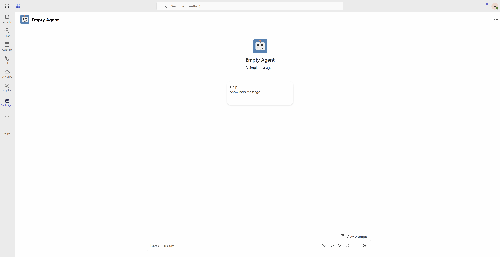

# Empty Demo - Teams Agent with Custom API

This demo showcases a Teams agent that demonstrates:
- **Event streaming** (typing indicators, real-time updates)
- **Message streaming** (progressive message delivery)
- **Adaptive Cards** (rich interactive UI)
- **SSO with OBO flow** to call Microsoft Graph and a custom API on behalf of the user

## What to Expect

1. **First launch**: User opens the agent in Teams and is prompted for consent to Empty API (Graph API consent is admin-granted)
2. **After consent**: Every message triggers:
   - Graph API call → displays user's full name
   - Empty API call → returns data with JWT token claims (for debugging)
3. **Demo features**: Streaming response with typing indicator, adaptive card with results

Resulting UX:



## Architecture

```
┌─────────────┐    ┌─────────────┐    ┌─────────────┐    ┌─────────────┐    ┌─────────────┐
│   Teams     │───>│  Azure Bot  │───>│ Empty Agent │───>│  Empty API  │    │ Graph API   │
│   Client    │    │   Service   │    │  (Python)   │    │  (FastAPI)  │    │   /me       │
└─────────────┘    └─────────────┘    └─────────────┘    └─────────────┘    └─────────────┘
      │                   │                  │                  │                  │
      │ 1. User sends     │                  │                  │                  │
      │    message        │                  │                  │                  │
      │                   │ 2. Routes to bot │                  │                  │
      │                   │─────────────────>│                  │                  │
      │                   │                  │                  │                  │
      │                   │                  │ 3. OBO exchange  │                  │
      │                   │                  │    for Graph API │                  │
      │                   │<─────────────────│                  │                  │
      │                   │─────────────────>│                  │                  │
      │                   │                  │                  │                  │
      │                   │                  │ 4. Call Graph    │                  │
      │                   │                  │─────────────────────────────────────>│
      │                   │                  │<─────────────────────────────────────│
      │                   │                  │                  │                  │
      │                   │                  │ 5. Get token     │                  │
      │                   │                  │    for Empty API │                  │
      │                   │<─────────────────│                  │                  │
      │                   │─────────────────>│                  │                  │
      │                   │                  │                  │                  │
      │                   │                  │ 6. Call Empty API│                  │
      │                   │                  │    with token    │                  │
      │                   │                  │─────────────────>│                  │
      │                   │                  │                  │                  │
      │                   │                  │ 7. API validates │                  │
      │                   │                  │    token, returns│                  │
      │                   │                  │    data + claims │                  │
      │                   │                  │<─────────────────│                  │
      │                   │                  │                  │                  │
      │ 8. Response with  │                  │                  │                  │
      │    Graph + API    │<─────────────────│                  │                  │
      │    data           │                  │                  │                  │
```

### Component Details

| Component | Description |
|-----------|-------------|
| **Teams Client** | User interface where the agent runs as a personal app |
| **Azure Bot Service** | Manages bot registration, channels, and **OAuth connections**. Handles token exchange - when the agent requests a token, Bot Service uses its OAuth connection settings to obtain tokens for configured scopes (Graph, Empty API) |
| **Empty Agent** | Python bot using Microsoft 365 Agent SDK. Calls `get_token()` to retrieve tokens from Bot Service OAuth connections, then uses them to call downstream APIs |
| **Empty API** | Simple FastAPI service protected by Entra ID. Validates JWT tokens and returns request data including token claims |
| **Graph API** | Microsoft's API for user profile data (display name, email) |

### How Azure Bot Service Token Exchange Works

Azure Bot Service simplifies OAuth by managing token exchange server-side:

1. **OAuth Connection** configured in Azure Bot (e.g., "graph", "emptyapi") with scopes like `User.Read` or `api://<id>/access_as_user`
2. When agent calls `get_token(context, "EMPTYAPI")`, the SDK asks Bot Service for a token
3. Bot Service uses its stored OAuth connection credentials to obtain a token with the configured scopes
4. Token is returned to the agent, ready to use for API calls

This approach offloads OAuth complexity from the agent code - no MSAL configuration or token caching needed in the bot itself.

## Prerequisites

- Python 3.10+, [uv](https://docs.astral.sh/uv/), Azure CLI (`az login`)
- Azure subscription, Microsoft 365 tenant with Teams
- VS Code with Port Forwarding extension

---

## Quick Start

### 1. Set Variables & Create Resource Group

```powershell
az login

$resourceGroup = "rg-empty-agent"
az group create --name $resourceGroup --location "westeurope"
```

---

## Part 1: Create the Empty API App Registration

The Empty API needs its own Entra ID app registration to validate incoming tokens.

### 2. Create Empty API App Registration

```powershell
$apiAppName = "empty-api"

# Create app registration for the API
$apiApp = az ad app create --display-name $apiAppName | ConvertFrom-Json
$apiAppId = $apiApp.appId

# Create service principal
az ad sp create --id $apiAppId

# Create client secret (needed for OBO token exchange by the agent)
$apiSecret = az ad app credential reset --id $apiAppId --years 1 | ConvertFrom-Json
$apiClientSecret = $apiSecret.password
$tenantId = (az account show | ConvertFrom-Json).tenantId

Write-Host "API App ID: $apiAppId"
Write-Host "API Client Secret: $apiClientSecret"
Write-Host "Tenant ID: $tenantId"
```

### 3. Expose API Scope for Empty API

```powershell
# Set Application ID URI for the API
az ad app update --id $apiAppId --identifier-uris "api://$apiAppId"

# Add scope for the API
$apiScopeGuid = [guid]::NewGuid().ToString()

$apiJson = '{"oauth2PermissionScopes":[{"adminConsentDescription":"Access Empty API as the signed-in user","adminConsentDisplayName":"Access Empty API","id":"' + $apiScopeGuid + '","isEnabled":true,"type":"User","userConsentDescription":"Access Empty API on your behalf","userConsentDisplayName":"Access Empty API","value":"access_as_user"}]}'

$apiJson | Out-File -FilePath api-scope.json -Encoding ASCII -NoNewline
az ad app update --id $apiAppId --set api=@api-scope.json
Remove-Item api-scope.json

Write-Host "API Scope: api://$apiAppId/access_as_user"
```

### 4. Configure Empty API .env

```powershell
@"
# Empty API Configuration
API_CLIENT_ID=$apiAppId
API_TENANT_ID=$tenantId

# Expected audience for token validation
API_AUDIENCE=api://$apiAppId
"@ | Out-File -FilePath empty-api/.env -Encoding UTF8
```

---

## Part 2: Create the Empty Agent App Registration

### 5. Create Agent App Registration

```powershell
$agentAppName = "empty-agent"

# Create app registration
$agentApp = az ad app create --display-name $agentAppName | ConvertFrom-Json
$agentAppId = $agentApp.appId

# Create service principal
az ad sp create --id $agentAppId

# Create client secret
$agentSecret = az ad app credential reset --id $agentAppId --years 1 | ConvertFrom-Json
$agentClientSecret = $agentSecret.password

Write-Host "Agent App ID: $agentAppId"
Write-Host "Agent Client Secret: $agentClientSecret"
```

### 6. Configure SSO Permissions for Agent (Graph API)

```powershell
# Add User.Read permission for Graph API
$graphId = "00000003-0000-0000-c000-000000000000"
$userReadId = "e1fe6dd8-ba31-4d61-89e7-88639da4683d"

az ad app permission add --id $agentAppId --api $graphId --api-permissions "$userReadId=Scope"

# Grant admin consent
az ad app permission admin-consent --id $agentAppId
```

### 7. Add Permission for Empty API to Agent

```powershell
# Add permission for agent to call Empty API
# First, get the scope ID we created earlier
$apiManifest = az ad app show --id $apiAppId | ConvertFrom-Json
$apiScopeId = $apiManifest.api.oauth2PermissionScopes[0].id

az ad app permission add --id $agentAppId --api $apiAppId --api-permissions "$apiScopeId=Scope"

# Grant admin consent for the API permission
az ad app permission admin-consent --id $agentAppId
```

### 8. Expose API for Agent SSO (Teams Token Exchange)

```powershell
# Set Application ID URI for the agent (required for Teams SSO)
az ad app update --id $agentAppId --identifier-uris "api://botid-$agentAppId"

# Add scope AND pre-authorize Teams clients
$agentScopeGuid = [guid]::NewGuid().ToString()
$teamsDesktop = "1fec8e78-bce4-4aaf-ab1b-5451cc387264"
$teamsWeb = "5e3ce6c0-2b1f-4285-8d4b-75ee78787346"

$agentApiJson = '{"oauth2PermissionScopes":[{"adminConsentDescription":"Access the bot as the signed-in user","adminConsentDisplayName":"Access as user","id":"' + $agentScopeGuid + '","isEnabled":true,"type":"User","userConsentDescription":"Access the bot on your behalf","userConsentDisplayName":"Access as you","value":"access_as_user"}],"preAuthorizedApplications":[{"appId":"' + $teamsDesktop + '","delegatedPermissionIds":["' + $agentScopeGuid + '"]},{"appId":"' + $teamsWeb + '","delegatedPermissionIds":["' + $agentScopeGuid + '"]}]}'

$agentApiJson | Out-File -FilePath agent-api.json -Encoding ASCII -NoNewline
az ad app update --id $agentAppId --set api=@agent-api.json
Remove-Item agent-api.json
```

### 9. Add Redirect URI for Agent

```powershell
az ad app update --id $agentAppId --web-redirect-uris "https://token.botframework.com/.auth/web/redirect"
```

### 10. Configure Empty Agent .env

```powershell
@"
# Service Connection (Bot identity)
CONNECTIONS__SERVICE_CONNECTION__SETTINGS__CLIENTID=$agentAppId
CONNECTIONS__SERVICE_CONNECTION__SETTINGS__CLIENTSECRET=$agentClientSecret
CONNECTIONS__SERVICE_CONNECTION__SETTINGS__TENANTID=$tenantId

# GRAPH Auth Handler Connection (for OBO exchange to Graph API)
CONNECTIONS__GRAPH__SETTINGS__CLIENTID=$agentAppId
CONNECTIONS__GRAPH__SETTINGS__CLIENTSECRET=$agentClientSecret
CONNECTIONS__GRAPH__SETTINGS__TENANTID=$tenantId

# Auth Handler Settings - Links Graph handler to Azure Bot OAuth connection
AGENTAPPLICATION__USERAUTHORIZATION__HANDLERS__GRAPH__SETTINGS__AZUREBOTOAUTHCONNECTIONNAME=graph
AGENTAPPLICATION__USERAUTHORIZATION__HANDLERS__GRAPH__SETTINGS__OBOCONNECTIONNAME=GRAPH

# Empty API Settings - Uses MSAL for OBO (not Azure Bot OAuth connection)
EMPTY_API_URL=http://localhost:8000
EMPTY_API_SCOPE=api://$apiAppId/access_as_user
"@ | Out-File -FilePath empty-agent/.env -Encoding UTF8
```

---

## Part 3: Create Azure Bot with OAuth Connections

### 11. Create Azure Bot

```powershell
az bot create `
    --resource-group $resourceGroup `
    --name $agentAppName `
    --app-type SingleTenant `
    --appid $agentAppId `
    --tenant-id $tenantId `
    --location "global"

# Enable streaming
az rest --method PATCH `
    --uri "https://management.azure.com/subscriptions/$(az account show --query id -o tsv)/resourceGroups/$resourceGroup/providers/Microsoft.BotService/botServices/${agentAppName}?api-version=2023-09-15-preview" `
    --body '{\"properties\":{\"isStreamingSupported\":true}}'

# Enable Teams channel
az bot msteams create --resource-group $resourceGroup --name $agentAppName
```

### 12. Create OAuth Connection for Graph API

```powershell
az bot authsetting create `
    --resource-group $resourceGroup `
    --name $agentAppName `
    --setting-name "graph" `
    --client-id $agentAppId `
    --client-secret $agentClientSecret `
    --service "Aadv2" `
    --provider-scope-string "openid profile User.Read" `
    --parameters "tenantId=$tenantId"
```

> **Note:** The Empty API uses MSAL's OBO flow directly (not Azure Bot OAuth connection) because the SDK's auth handlers don't correctly support custom API OBO when the incoming token needs to be the SSO token (with agent as audience).

---

## Part 4: Run the Demo

### 13. Start Empty API

```powershell
cd empty-api
uv run uvicorn app:app --host 0.0.0.0 --port 8000
```

### 14. Start Empty Agent (in another terminal)

```powershell
cd empty-agent
uv run python app.py
```

### 15. Set Up Dev Tunnel for Agent

Use VS Code Port Forwarding:
1. Forward port `3978` → Set visibility to **Public**
2. Copy the tunnel URL

### 16. Update Bot Endpoint

```powershell
az bot update `
    --resource-group $resourceGroup `
    --name $agentAppName `
    --endpoint "https://YOUR-TUNNEL-URL/api/messages"
```

### 17. Generate & Upload App Package

```powershell
cd empty-agent
.\generate_app_package.ps1
```

Upload `appPackage/app-package.zip` to Teams (sideload or Admin Center).


