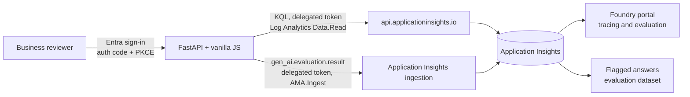
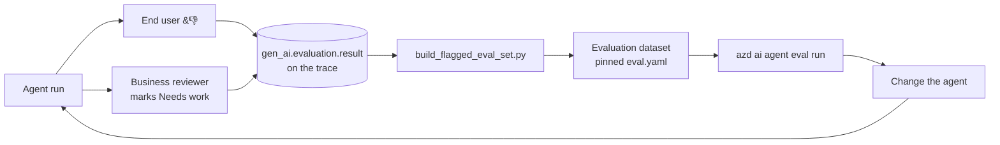

# Annotation review

A business-facing web app for rating agent answers **after the fact**, without opening the
Microsoft Foundry portal.

## What this step proves

Foundry trace annotations are **not** a proprietary Foundry resource and they are **not**
locked to the Foundry portal.

An annotation is an OpenTelemetry custom event named `gen_ai.evaluation.result`, written into
the Application Insights resource that the Foundry project is connected to, correlated to the
original trace through `operation_Id` and `operation_ParentId`. The portal's **Annotate**
button writes exactly this event. So does this app. Both show up in the same place.

That means human feedback can be collected wherever it is cheapest to collect:

| Who | Where | `microsoft.gen_ai.human_evaluation.source` |
| --- | --- | --- |
| End user, in the moment | Thumbs up/down in the chat UI | `end_user` |
| Business reviewer, ex post | This app | `builder` |
| Engineer | Foundry portal | `builder` |

Verified live against the showcase project, not inferred from documentation. The Foundry
data-plane was probed for `/annotations`, `/traces`, and `/feedback` first; all returned
`404`, and `azure-ai-projects` exposes no annotation operation. The event path is the
supported one, and it is fully open.

## Architecture



Two calls, both with the **reviewer's own delegated token**, so Azure RBAC decides who may
read traces and who may annotate. The app holds no secret and no client credential.

- **Read** — `POST https://api.applicationinsights.io/v1{resourceId}/query`, scope
  `https://api.loganalytics.io/Data.Read`, role `Log Analytics Reader`.
- **Write** — `POST {ingestionEndpoint}/v2.1/track`, scope
  `https://monitor.azure.com/AMA.Ingest`, role `Monitoring Metrics Publisher`.

The write uses the raw ingestion endpoint rather than the Azure Monitor OpenTelemetry
exporter on purpose: the exporter binds one credential per process, which would attribute
every annotation to the app instead of to the reviewer who wrote it.

Entra issues an access token for one resource per authorization request, so sign-in runs two
consecutive consent legs (Log Analytics, then Azure Monitor). Only the first shows a prompt.

## Prerequisites

- The showcase deployed, so there are traces to review.
- `az login` with rights to create an Entra application and assign roles.
- Reviewers need `Log Analytics Reader` **and** `Monitoring Metrics Publisher` on the
  Application Insights resource.

## Setup

Creates the public-client Entra application and grants the roles. Idempotent.

```powershell
uv run python scripts\setup_entra_app.py --reviewer someone@contoso.com
```

If the tenant blocks user consent, an Entra administrator runs the
`az ad app permission admin-consent` command the script prints at the end.

## Run

```powershell
uv run python run_local.py
```

Configuration is resolved from Azure at start up, so no connection string or resource id is
stored in the repository. Open <http://localhost:8080> and sign in.

## Demo script

1. **Live signal.** In the chat client, ask the agent something and press 👎 with a short
   comment. That is an `end_user` annotation, written onto the trace as it happens.
2. **Considered review.** Open this app. Business language only: *Customer asked* /
   *Agent answered*. No spans, no trace ids, no KQL. Filter to **Not yet rated**, read a few
   answers, mark one **Needs work** with a reason.
3. **Same place.** Open the same trace in the Foundry portal. Both ratings are there, on the
   original run, attributed to whoever gave them.
4. **Improvement loop.** Turn everything humans rejected into an evaluation set and run it:

   ```powershell
   uv run python scripts\build_flagged_eval_set.py
   azd ai agent eval run --config eval-flagged-review.yaml `
     --name flagged-review-v31 --no-prompt -C foundry-showcase\main-agent
   ```

   The script reads the failing annotations back out of Application Insights, rebuilds the
   question and the rejected answer from the same traces, and writes
   `main-agent\datasets\flagged-review\flagged-review_dg.jsonl` plus a pinned
   `main-agent\eval-flagged-review.yaml`. Every case is a real conversation a human
   rejected, with the reviewer's reason as its description. Nothing is synthesised.

5. Close the loop: change the agent, redeploy, and re-run the same pinned evaluation
   against the new version to see whether the answers humans disliked got better.

**Export evaluation set** in the toolbar downloads the same JSONL without running anything,
for reviewers who just want the list.

## The loop



## Validation

```powershell
uv run pytest
```

Covers the event schema, the ingestion envelope correlation tags, the `gen_ai` message
decoding, the evaluation set builder, and the API surface against a mocked Azure Monitor.

## Known gaps

- Sessions are in memory, so restarting the app signs reviewers out.
- Annotations are append-only. A correction is a new event; the app shows the rating history
  and treats the newest as current.
- Application Insights indexes new events in about a minute, so a rating is shown optimistically
  before **Refresh** and the Foundry portal catch up.
- In-app thumbs land on the gateway span and reviewer ratings land on the model span, so
  annotations are matched to runs by trace rather than by span.
- The evaluation set is built from local files and a pinned `eval.yaml`. Publishing it as a
  versioned Foundry dataset is a separate step.
