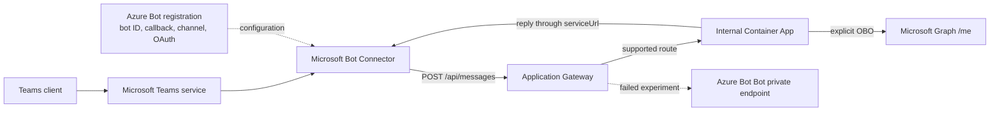

# Private Bot Proxy

This demo tests whether Microsoft Teams messaging can enter Azure Bot Service through its `Bot` private endpoint when that endpoint is republished by Azure Application Gateway.

**Verdict: no.** Application Gateway reached the private endpoint over valid TLS, but `POST /api/messages` returned 404 and never reached the Python agent.

## Architecture



The Teams package contains a bot ID, not a messaging URL. The Azure Bot registration maps that ID to `https://botservice.tomasonline.net/api/messages`. The Microsoft Bot Connector sends the authenticated request to Application Gateway, which forwards it to the private Container App.

The Azure Bot `Bot` private endpoint exposes a Direct Line App Service Extension surface. It is not a private version of the registered Teams callback.

## Implementation

- Microsoft 365 Agents SDK for Python; no legacy Bot Framework SDK.
- Internal Azure Container Apps environment with no public application origin.
- Application Gateway Standard_v2 as the only public application ingress.
- Let's Encrypt certificate issued through certbot DNS-01 and stored in Key Vault.
- Terraform using the AzAPI provider.
- Managed identities and federated credentials; no application secrets.
- Connector JWT validation, Teams SSO, explicit OBO exchange, and Graph `/me`.
- Application Gateway, Azure Bot, and Container App diagnostics in Log Analytics.
- No Direct Line channel or Direct Line App Service Extension.

## Prerequisites

- Azure CLI authenticated with subscription and Microsoft Graph administration rights.
- Terraform, `uv`, PowerShell 7, and `curl`.
- Access to the `tomasonline.net` Azure DNS zone.
- Permission to upload a custom Teams app and grant delegated Graph `User.Read`.

The deployment creates billable Application Gateway, Container Apps, Log Analytics, Key Vault, ACR, public IP, private endpoint, and temporary certificate-runner resources.

## Deploy

```powershell
.\scripts\deploy.ps1
```

The no-argument deployment provisions infrastructure, issues the certificate, builds the container remotely, configures Azure Bot and Teams SSO, generates the Teams package, and runs deployed smoke checks.

To use another ACME contact:

```powershell
.\scripts\deploy.ps1 -CertificateEmail person@example.com
```

## Validate

```powershell
.\scripts\local-smoke.ps1
.\scripts\deployed-smoke.ps1
```

Install the generated package from `.artifacts\teams-package\private-bot-proxy.zip`, then:

- Send `CONTROL-<guid>` to test the authenticated Teams-to-agent path.
- Send `SSO-<guid>` to test token A, explicit OBO, and Graph `/me`.
- Run `.\scripts\run-experiment.ps1` for the reversible Application Gateway backend and Bot public-network-access experiment.

The experiment always restores Bot public access, the Teams channel, and the supported ACA backend route.

## Verified result

| Test | Result |
| --- | --- |
| Supported Teams route | Connector request reached Application Gateway, routed privately to ACA, returned 202, and Teams displayed the reply. |
| Connector authentication | The Agents SDK validated issuer, audience, signature, tenant, and service URL; unsigned and forged requests returned 401. |
| Teams SSO and OBO | Token A had the expected audience, tenant, and scope. `AGENT_APP.auth.exchange_token` produced token B, and Graph `/me` returned the signed-in profile. |
| Bot private endpoint with public access disabled | Teams still reached Application Gateway. Gateway routed to the private endpoint over TLS, but `/api/messages` returned 404. ACA received nothing and Teams received no reply. |
| Restoration | Public access, Teams channel, ACA route, control reply, and deployed smoke checks succeeded again. |

Application Gateway logs identify the caller as `Microsoft-SkypeBotApi (Microsoft-BotFramework/3.0)` from rotating Microsoft addresses. The gateway records the source IP, host, URI, user agent, status, private backend, latency, and frontend/backend TLS. It does not log the bearer token.

## Security boundary

Azure Bot Service supplies registration, channel, identity, and OAuth configuration. The shared Microsoft Bot Connector is the Teams data plane. Bot Service networking controls do not firewall the registered Teams callback.

Protect the callback at Application Gateway and validate every Connector JWT in the application. Do not use Connector source IPs as the authentication boundary.

Disabling Bot public access is not guaranteed to preserve channel management, OAuth, Direct Line, or other channels. The observed existing Teams delivery is not a general support guarantee.

Generated credentials, certificates, Terraform state, Teams packages, and evidence remain under ignored `.artifacts`.

## Cleanup

```powershell
.\scripts\cleanup.ps1
```

Cleanup removes the application layer, bootstrap resources, generated Entra application, Teams installation and catalog entry, and the deterministic soft-deleted Key Vault.
